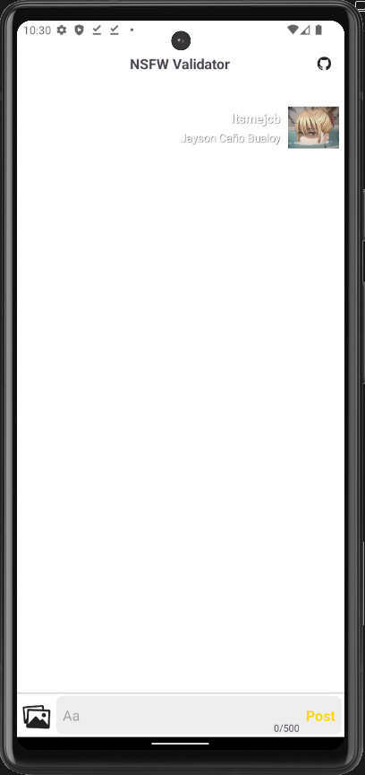
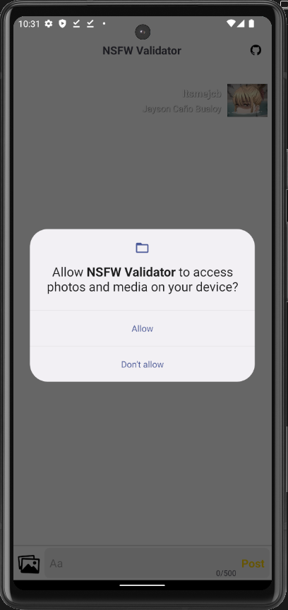
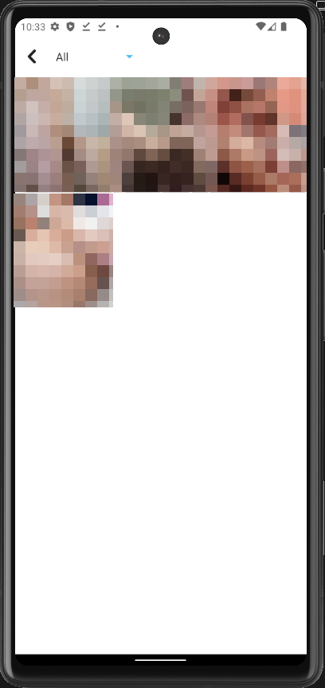
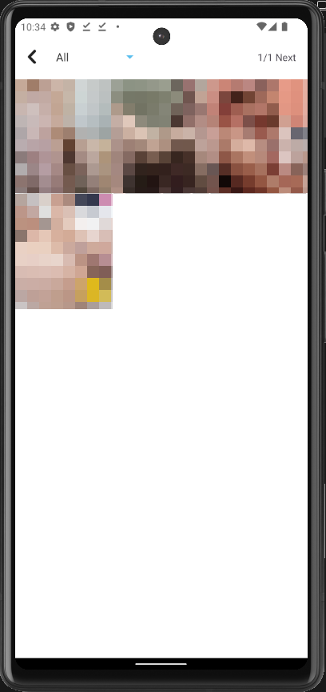
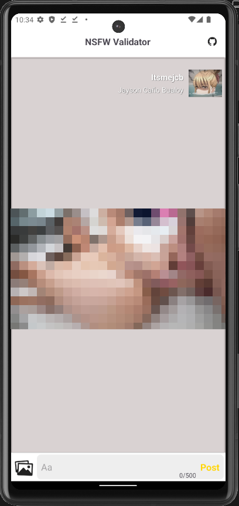
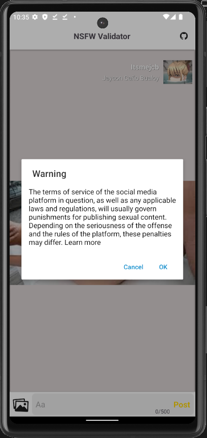

# NSFW Validator

This Kotlin project provides an NSFW (Not Safe For Work) validator to filter out pornographic images. The project uses machine learning to detect inappropriate content in images and flag them accordingly.

## Features

- Detects and filters pornographic images.
- Provides a simple API for image validation.
- Can be integrated with Android applications.

## Download

 [AAB](./Build/NSFWValidator.aab)
 [APK](./Build/NSFWValidator.apk)
 
## Usage

| No. | Screen Shot | Description |
|---------|---------|---------|
| 1.   | | index layout    |
| 2.   | | Storage Permission    |
| 3.   | | List of Image/Photos    |
| 4.   | | Select Image/Photos    |
| 5.   | | View Image/Photos    |
| 6.   | | Detect if the image contain Sexual Content    |
